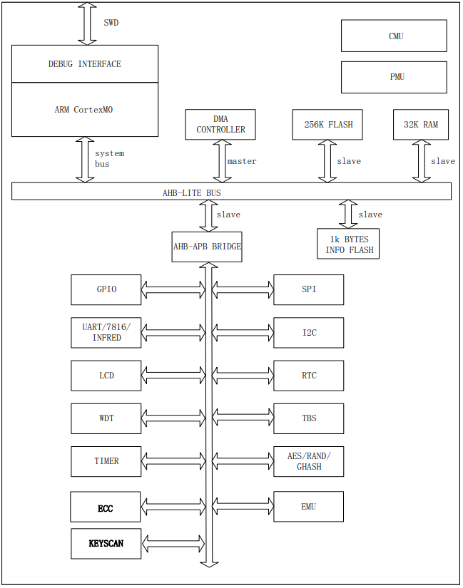

# [HT5027](https://github.com/SoCXin/HT5027)

#### [Vendor](https://github.com/SoCXin/Vendor)：[hitrendtech](http://www.hitrendtech.com/)
#### [Core](https://github.com/SoCXin/Cortex)：[Cortex M0](https://github.com/SoCXin/CM0)
#### [Level](https://github.com/SoCXin/Level)：39.32MHz

[HT5027](https://github.com/SoCXin/HT5027)是一颗低功耗、高性能的单相电能计量 SoC 芯片，片内集成 32-bit ARM 内核、256K flash、32K SRAM，支持断相防窃电功能的硬件 EMU 模块，带有温度自补偿功能的高精度 RTC 模块，以及 LCD驱动等功能，为单相多功能、防窃电电能表提供高集成的单芯片解决方案。

* LQFP100：HT5023
* LQFP80：HT5025
* LQFP64：HT5027
* LQFP48：HT5029B、HT5029

#### 关键特性

* 256K Flash+1K Information Block、32K SRAM
* 持断相防窃电功能的硬件 EMU 模块

### [资源收录](https://github.com/SoCXin/HT5027)

* [参考文档](docs/)
* [参考资源](src/)
* [参考工程](project/)

### [选型建议](https://github.com/SoCXin)

[HT5027](https://github.com/SoCXin/HT5027)

###  [www.SoC.xin(芯)](http://www.SoC.Xin)
