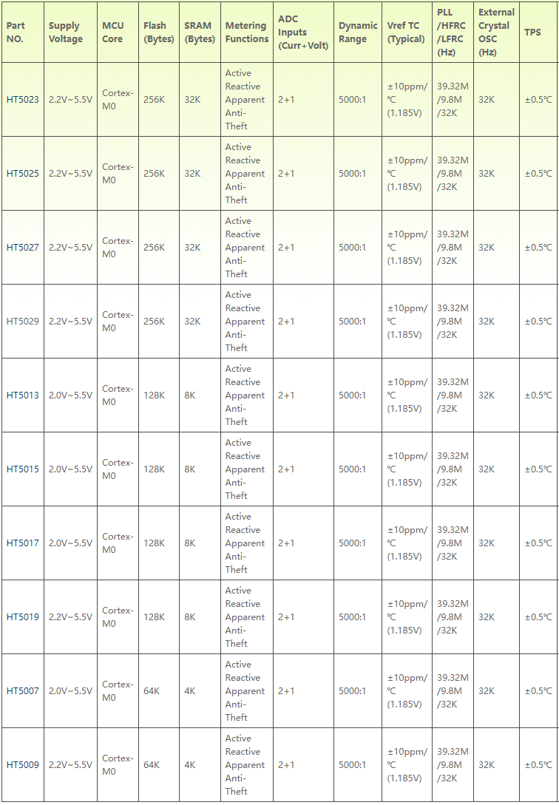

# [HT5027](https://github.com/SoCXin/HT5027)

* [hitrendtech](http://www.hitrendtech.com/): [Cortex-M0](https://github.com/SoCXin/Cortex)
* [L2R3](https://github.com/SoCXin/Level): 39.32 MHz

## [简介](https://github.com/SoCXin/HT5027/wiki)

[HT5027](http://www.hitrendtech.com/list_product/14)是一颗低功耗、高性能的单相电能计量 SoC 芯片，片内集成 32-bit ARM 内核、256K flash、32K SRAM，支持断相防窃电功能的硬件 EMU 模块，带有温度自补偿功能的高精度 RTC 模块，以及 LCD驱动等功能，为单相多功能、防窃电电能表提供高集成的单芯片解决方案。

相对于传统51核的计量SoC，该系列则具备更为突出的综合性价比及平台化优势，特别是对应到海外的防窃电应用场合，其在低功耗方面的性能表现则更为突出。

HT5023配有79个GPIO、6路UART、7个外部中断，LCD支持4x43/6x41/8x39段，采用LQFP100封装，且向下兼容HT5013。

HT5025配有59个GPIO、5路UART、5个外部中断，LCD支持4x34/6x32/8x30段，采用LQFP80封装，不支持SPI、I2C通讯，且向下兼容HT5015。

HT5027配有43个GPIO、3路UART、4个外部中断，LCD支持4x24/6x22/8x20段，采用LQFP64封装，不支持SPI、I2C通讯，且向下兼容HT5017。

### 关键特性

* 256K Flash、1K Information Block、32K SRAM
* 持断相防窃电功能的硬件 EMU 模块
* 工作电压范围：2.2V ~ 5.5V
* 工作温度范围：-40℃ ~ 85℃

### [资源收录](https://github.com/SoCXin)

* [参考资源](src/)
* [相关文档](docs/)
* [典型应用](project/)
* [Xin文档](https://docs.soc.xin/HT5027)

### [选型建议](https://github.com/SoCXin)

### [探索芯世界 www.SoC.Xin](http://www.SoC.Xin)
